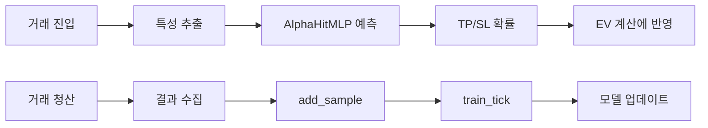

# Code Map — 완전 확장판 (메서드/함수 수준, 한글 주석 포함)

이 문서는 **codex_quant** 레포지토리의 모든 핵심 모듈, 클래스, 주요 메서드/함수를 영어 설명과 한국어 주석을 병기하여 정리한 코드 맵입니다.

> **목적**: 리팩터링, 문서화, 테스트 작성 시 "무엇이 어디에 있는가"를 빠르게 확인하기 위한 참조 자료
> **주의**: 자동 스캔 + 수동 검토 기반. 코드가 바뀌면 이 문서도 갱신하세요.

### 2026-02-10 추가 맵 (mu_alpha/청산/레버리지)

- `main_engine_mc_v2_final.py:_maybe_persist_alpha_samples`
  - causal 학습 샘플에 `symbols/timestamps`를 포함 저장하고 라벨 파생값 `y_net`, `y_fee_adj`, `y_hstar`, `y_hstar_net`, `hstar_bars`를 생성/영속화
  - 목적: 방향모델 학습 라벨을 `h*`/순수익 기준으로 확장(기존 단일 `y` fallback 유지)
- `main_engine_mc_v2_final.py:_load_alpha_training_samples`
  - 저장된 `symbols/timestamps`를 로드해 메모리 deque 복원 시 샘플 메타정보를 유지
- `scripts/train_alpha_weights.py:_prepare_direction_targets`
  - 라벨 후보별 활성비율 검사(`ALPHA_DIRECTION_LABEL_MIN_ACTIVE_RATIO`)를 추가해 희소 라벨 소스 자동 제외
  - 보고 항목에 `candidate_active_ratios`, `selected_active_ratio`를 추가
- `scripts/auto_reval_policy_tuner.py:main`
  - `counterfactual_replay`의 `top_regret_reasons`를 집계해 `event_mc_exit/unified_flip/ev_drop_exit/unrealized_dd` 비중 기반 2차 튜닝 수행
  - 신규 자동 튜닝 대상: `EVENT_EXIT_CONFIRM_*`, `UNREALIZED_DD_CONFIRM_*`, `EVENT_MC_TSTAR_*`, `EXIT_SCORE_DROP`, `ALPHA_DIRECTION_LABEL_*`

- `main_engine_mc_v2_final.py:_dynamic_leverage_risk`
  - 신규 계산값: `entry_quality_score`, `one_way_move_score`, `leverage_signal_score`
  - 신규 환경변수: `LEVERAGE_SIGNAL_*`, `LEVERAGE_ENTRY_QUALITY_*`, `LEVERAGE_ONEWAY_*`
  - 동작: EV/risk 기반 레버리지 + 신호기반 레버리지 혼합
- `main_engine_mc_v2_final.py:_maybe_exit_position`
  - 신규 가드: `EXIT_RESPECT_ENTRY_*` (고품질 진입의 조기청산 억제)
  - 적용 대상: `unified_flip`, `unified_cash`, `unrealized_dd_*` (shock/심각 DD 예외)
- `main_engine_mc_v2_final.py:_capture_position_observability` / `_record_trade`
  - 포지션/체결에 `entry_quality_score`, `one_way_move_score`, `leverage_signal_score` 저장
- `core/database_manager.py:trades`
  - 신규 컬럼: `entry_quality_score`, `one_way_move_score`, `leverage_signal_score`
- `scripts/auto_reval_policy_tuner.py`
  - Reval KPI 기반 자동 튜닝 대상에 `LEVERAGE_SIGNAL_*`, `EXIT_RESPECT_ENTRY_*`, `UNREALIZED_DD_SEVERE_MULT` 포함

---

## 목차
1. [설정 및 환경변수](#1-설정-및-환경변수--config)
2. [엔트리포인트](#2-엔트리포인트--entry-point)
3. [코어 런타임](#3-코어-런타임--core-runtime)
4. [엔진 허브 및 조정](#4-엔진-허브-및-조정--engine-hub)
5. [Monte Carlo 엔진 패밀리](#5-monte-carlo-mc-엔진-패밀리)
6. [PMaker / ML 모델](#6-pmaker--ml-모델)
7. [유틸리티](#7-유틸리티--utils)
8. [대시보드 UI 계약](#8-대시보드--ui-계약)
9. [JAX vs NumPy 경로](#9-jax-vs-numpy-경로)

---

## 1. 설정 및 환경변수 / Config

### `config.py`
전역 설정 및 환경변수 로딩을 담당하는 모듈.

| 함수/상수 | 설명 | 한글 |
|-----------|------|------|
| `_env_symbols(name, default)` | 환경변수에서 심볼 리스트 파싱 | 쉼표 구분 심볼 문자열 → 리스트 |
| `_load_env_file(path)` | `.env` 파일 로드 (덮어쓰지 않음) | 기존 환경변수 유지 |
| `PORT` | 대시보드 서버 포트 (기본: 9999) | — |
| `SYMBOLS` | 거래 대상 심볼 리스트 (기본 18개) | — |
| `MC_N_PATHS_LIVE` | 라이브 MC 시뮬레이션 경로 수 (기본: 16384) | — |
| `MC_N_PATHS_EXIT` | Exit policy MC 경로 수 (기본: 16384) | — |
| `ENABLE_LIVE_ORDERS` | 실거래 주문 활성화 여부 | True=실거래, False=페이퍼 |
| `MAX_LEVERAGE` | 최대 허용 레버리지 (기본: 100) | — |
| `DEFAULT_LEVERAGE` | 기본 레버리지 (기본: 5) | — |
| `DECISION_REFRESH_SEC` | 결정 갱신 주기 (초) | — |
| `MAKER_TIMEOUT_MS`, `MAKER_RETRIES`, `MAKER_POLL_MS` | 메이커 주문 타임아웃/재시도/폴링 설정 | — |

---

## 2. 엔트리포인트 / Entry point

### `main.py`
| 함수 | 설명 | 한글 |
|------|------|------|
| `_parse_args()` | CLI 인자 파싱 및 유효성 검사 | 명령행 옵션 처리 |
| `_apply_default_run_mode()` | 기본 런 모드 적용 | 환경변수/옵션에 따른 기본 실행 모드 설정 |
| `main()` | `LiveOrchestrator`와 `DashboardServer`를 생성/시작 | 전체 서비스 기동부 |

### `main_engine_mc_v2_final.py`
단일 파일 런타임(standalone). CCXT Bybit 연결 + 대시보드 서버 + 주문 실행 루프를 포함.
| 함수/메서드 | 설명 | 한글 |
|------------|------|------|
| `LiveOrchestrator.__init__` | 엔진/마켓/리스크/상태 초기화 | 단일 파일 런타임 설정 |
| `_execute_order` | 주문 실행(시장가/메이커-후-테이커) | 헤지 모드 `positionIdx` 포함 |
| `_maybe_place_order` | 주문 비동기 트리거 | 주문 실행 게이트 |
| `decision_loop` | 결정 루프 | 심볼별 의사결정/진입/청산 |
| `broadcast` | 대시보드 브로드캐스트 | 실시간 상태/로그/alerts 전달 |
| `_liquidate_all_positions` | 비상 청산 | Kill Switch 대응 |
| `async main()` | aiohttp 서버/루프 시작 | 단일 엔트리포인트 |

#### `decision_loop` 파이프라인 상세 (2026-01-22 업데이트)

| Stage | 단계 | 설명 |
|-------|------|------|
| 1 | Context Collection | `_build_decision_context()`로 심볼별 ctx 수집 |
| 2 | Batch Decision | `hub.decide_batch(ctx_list)`로 MC 엔진 배치 평가 |
| **2.5** | **Portfolio Ranking** | UnifiedScore 기준 순위 정렬 → TOP N 선택 → Kelly 배분 계산 |
| **2.6** | **Switching Eval** | 보유 UnifiedScore vs 신규 UnifiedScore 비교, 교체 판단 |
| 3 | Result Application | `_apply_decision()`으로 진입/청산 실행 |

**포트폴리오 관리 관련 상수:**
| 상수 | 기본값 | 설명 |
|------|--------|------|
| `TOP_N_SYMBOLS` | 4 | 동시 거래 대상 최대 심볼 수 |
| `USE_KELLY_ALLOCATION` | true | Kelly 배분 활성화 여부 |
| `USE_CONTINUOUS_OPPORTUNITY` | true | 연속 기회 평가 활성화 |
| `SWITCHING_COST_MULT` | 2.0 | 교체 비용 배수 |

**Kelly 배분 공식 (UnifiedScore 기반):**
```
f_i = μ_i / σ_i²  (개별 Kelly 비중)
f_normalized = f_i / Σf_i  (정규화)
```

**교체 조건:**
```
UnifiedScore_new > UnifiedScore_hold
```

#### 몬테카를로 시뮬레이션 청산 로직 (Exit Policy)

**기본 설정: `SKIP_EXIT_POLICY=false`** — 모든 청산 로직을 MC 시뮬레이션에 반영하여 정확한 EV 계산

**반영되는 청산 조건 (5가지):**

| 청산 조건 | 트리거 | 설명 |
|----------|--------|------|
| **1. TP (Take Profit)** | `ROE ≥ tp_target` | 목표 수익률 도달 시 청산 |
| **2. SL (Stop Loss)** | `ROE ≤ sl_target` | 손절 수준 도달 시 청산 |
| **3. Time Stop** | `t ≥ horizon_sec` | 최대 보유 시간 초과 시 청산 |
| **4. Drawdown Stop** | `unrealized_dd ≤ dd_stop_roe` | 미실현 손실이 임계값 초과 시 청산 |
| **5. Dynamic Policy** | `score_flip` or `hold_bad` | 확률 기반 동적 청산 (레짐별) |

**청산 파라미터 (레짐별 차등 적용):**

```python
# TP/SL 타겟 계산 (변동성 기반)
tp_target_roe = horizon_factor × sigma × sqrt(horizon_sec) × TP_MULTIPLIER
sl_target_roe = -horizon_factor × sigma × sqrt(horizon_sec) × SL_MULTIPLIER

# 레짐별 확률 임계값
POLICY_P_POS_ENTER = {"bull": 0.52, "bear": 0.50, "chop": 0.52, "volatile": 0.55}
POLICY_P_SL_ENTER_MAX = {"bull": 0.20, "bear": 0.25, "chop": 0.20, "volatile": 0.15}
POLICY_P_TP_ENTER_MIN = {"bull": 0.15, "bear": 0.12, "chop": 0.15, "volatile": 0.18}

# 드로우다운 손절 (기본값)
DD_STOP_ROE = -0.02  # -2% 미실현 손실 시 강제 청산
```

**Exit Policy 계산 프로세스:**
```
1. 각 경로(path)별로 매 decision_dt_sec(5초)마다 청산 조건 체크
2. TP/SL/DD Stop 중 하나라도 hit → 즉시 청산
3. Time Stop 도달 → 만기 청산
4. Dynamic Policy: 
   - score_flip: 롱→숏 또는 숏→롱으로 신호 반전 시
   - hold_bad: 보유 중 확률이 임계값 이하로 하락 시
5. 각 경로의 청산 시점 ROE 수집 → EV = mean(ROE - fee)
```

**`SKIP_EXIT_POLICY=true` 설정 시:**
- 청산 로직 생략, 단순 만기 평균 수익으로 EV 근사
- 속도 향상 (첫 실행 시 ~10-15초 단축) but 정확도 하락
- **권장하지 않음** — 프로덕션 환경에서는 false 사용

**Change Log (selected):**
- 2026-02-11: `unified_flip` exit 완화 + 방향게이트 적응화 — `_maybe_exit_position`의 `unified_flip` 경로를 모드별 확인틱(`UNIFIED_FLIP_CONFIRM_*`)과 역신호 강도(`UNIFIED_FLIP_MIN_*`) 및 `t*` 진행률 가드(`UNIFIED_FLIP_TSTAR_GUARD_ENABLED`, `UNIFIED_FLIP_MIN_PROGRESS_*`)로 재구성. 동시에 진입 `dir_gate`에 자동튜너 KPI 연동 적응 임계값(`ALPHA_DIRECTION_ADAPTIVE_*`)을 추가해 성능 저하 시 보수화/회복 시 완화를 자동 적용. 관측성에는 `pred_mu_dir_prob_long` 영속화를 추가 (`main_engine_mc_v2_final.py`, `state/bybit.env`, `.env.example`).
- 2026-02-10: 레버리지 1x 고착 실원인 복구 — `_dynamic_leverage_risk` 강제 패스가 `MAINT_MARGIN_RATE` NameError로 실패하며 `LEVERAGE_TARGET_MIN`(1x) fallback으로 고정되던 경로를 수정. 동시에 `lev_*` 진단 필드를 trade raw_data에 영속화하고, 디레버리지 완화 규칙(`LEVERAGE_SIGMA_STRESS_CLIP`, `LEVERAGE_BALANCE_REJECT_*`) + Auto-tune 최소 바닥(`LEVERAGE_AUTOTUNE_MIN_*`)을 추가해 과도한 레버리지 축소 재발을 방지 (`main_engine_mc_v2_final.py`, `scripts/auto_reval_policy_tuner.py`, `scripts/diagnose_leverage_floor.py`, `state/bybit.env`, `.env.example`).
- 2026-02-10: Reval 기반 자동 튜닝 운영화 — 배치 리포트(`RevalRpt`) 완료 시 `scripts/auto_reval_policy_tuner.py`가 진단/카운터팩추얼 지표로 방향/청산/레버리지 파라미터 오버라이드를 생성(`state/auto_tune_overrides.json`)하고 필요 시 방향모델 재학습을 자동 실행. 엔진은 오버라이드를 런타임 hot-reload하고 대시보드에 `AutoTune` 진행 상태 및 `αWgt`의 `new_exits/trigger`를 표시 (`scripts/auto_reval_policy_tuner.py`, `scripts/run_auto_reval_singleton.py`, `main_engine_mc_v2_final.py`, `dashboard_v2.html`).
- 2026-02-10: Auto Reval 누적 진행 상태 추가 — `auto_reval_db_reports.py`에 배치 누적 진행(`progress.completed_batches`, `progress.completed_reports_total`, `new_closed_total_cum`)을 영속화하는 `--progress-file` 경로를 도입하고, 엔진/대시보드에서 해당 필드를 표시해 `new_closed_total` 배치 리셋(100→0)과 누적 진행을 분리 가시화 (`scripts/auto_reval_db_reports.py`, `scripts/run_auto_reval_singleton.py`, `main_engine_mc_v2_final.py`, `dashboard_v2.html`).
- 2026-02-10: 레버리지 바닥 고착 완화 + 50x 조건부 개방 — `_dynamic_leverage_risk`에 레짐별 상한(`LEVERAGE_REGIME_MAX_*`)과 고신뢰 구간 확장 게이트(`LEVERAGE_AGGRESSIVE_*`)를 추가하고, `110007` 거절 이력 기반 자동 디레버리지(`LEVERAGE_BALANCE_REJECT_*`), 바닥 고착 진입 차단(`lev_floor_lock`, `LEVERAGE_FLOOR_LOCK_*`), 다회 축소 재시도(`LIVE_ORDER_RETRY_MAX_ATTEMPTS`)를 적용 (`main_engine_mc_v2_final.py`, `state/bybit.env`, `.env.example`).
- 2026-02-09: 2/3/4단계 후속 운영 보강 — `+200 EXIT` 누적 시 방향모델 재튜닝 강제 트리거(`ALPHA_TRAIN_TRIGGER_NEW_EXITS`)와 학습 상태 영속화(`state/alpha_train_state.json`)를 추가하고, `event_mc_exit`/`unrealized_dd`를 `shock/normal/noise` 모드별 임계값·사유(`event_mc_exit_<mode>`, `unrealized_dd_<mode>`)로 세분화. 잔존 고레버리지(기본 5x+) 포지션은 비동기 단계 하향(`LEGACY_5X_DELEVERAGE_*`)으로 강제 디레버리지 (`main_engine_mc_v2_final.py`, `state/bybit.env`, `.env.example`).
- 2026-02-09: `NewExit` 카운터 분리 — rolling baseline(`reval_baseline`)과 독립된 누적 anchor(`state/new_exit_anchor.json`)를 도입해 `new_closed_total_cum`(리셋 없음) + `new_closed_total_batch`(배치 진행) 동시 제공, 대시보드 표기를 `누적 | 배치`로 변경 (`main_engine_mc_v2_final.py`, `dashboard_v2.html`).
- 2026-02-09: 방향 게이트 2차 강화 — small-gap `dir_gate`에 side-probability(`mu_dir_prob_long`) 조건을 추가해 확률 정합이 낮은 LONG/SHORT 진입을 차단하고, 운영 임계값(`ALPHA_DIRECTION_GATE_MIN_*`)을 상향 튜닝 (`main_engine_mc_v2_final.py`, `state/bybit.env`, `.env.example`).
- 2026-02-09: Alpha hot-reload 확장 + 청산 확인틱 보강 — `mlofi_weight_path` 파일 변경을 런타임에서 자동 리로드(`[ALPHA_MLOFI]` 로그)하도록 추가하고, `_maybe_exit_position`의 `hybrid_exit` 경로에 Shock/Noise 연동 confirmation gate(`HYBRID_EXIT_CONFIRM_*`)를 적용. row payload에 `vpin/hurst/mu_dir_*` alias를 추가해 대시보드/리포트 호환성 강화 (`main_engine_mc_v2_final.py`, `state/bybit.env`, `.env.example`).
- 2026-02-09: 누적 정체 복구 + 자동 리포트 고도화 — `ENV_PROFILE=bybit` 고정, `hybrid_planner` 시그니처 길이 mismatch 방어, `LIVE_LIQUIDATION_TRIGGER_SAFETY`/`ENTRY_BLOCK_EVENT_MC_EXIT` 토글 추가, `hold_eval_loop` eval-only 고정(스레드 주문 오류 방지), `auto_reval_db_reports.py` Stage-4 baseline/compare 자동 생성, `counterfactual_replay.py --since-id` 추가 (`main_engine_mc_v2_final.py`, `engines/mc/hybrid_planner.py`, `scripts/auto_reval_db_reports.py`, `scripts/counterfactual_replay.py`, `trainers/online_alpha_trainer.py`, `state/bybit.env`).
- 2026-02-09: 4단계(레버리지/노출 동적화) 적용 — `_dynamic_leverage_risk`에 VPIN/신뢰도/변동성 디레버리징 및 `LEVERAGE_MIN_LIQ_DISTANCE` 기반 레버리지 상한 캡을 추가하고, `_calc_position_size`에 독성/신뢰도 기반 노출 스케일링(`EXPOSURE_DYNAMIC_*`)을 도입 (`main_engine_mc_v2_final.py`, `state/bybit.env`, `.env.example`).
- 2026-02-09: 청산 3단계(충격 대응 vs 일반 변동 분리) 1차 구현 — `event_mc_exit`, `hold_vs_exit`, `unified_cash` 경로에 상태형 확인 tick 게이트를 도입해 단발성 약화 신호의 조기 청산을 억제하고, `shock_score/noise_mode`에 따라 확인 횟수를 동적으로 분기. 진단 필드(`*_confirm_mode/required/count/confirmed`)를 `decision.meta`/position에 기록 (`main_engine_mc_v2_final.py`, `state/bybit.env`, `.env.example`).
- 2026-02-09: Stage-1/2 고도화 반영 — `entry_id` 영속화(ENTRY↔EXIT 매칭 alias), `auto_reval` 대시보드 상태칩(`RevalRpt`) 추가, 방향모델 `by_regime` 추론/학습 지원, small-gap 저신뢰 진입 차단(`dir_gate`) 도입 (`core/database_manager.py`, `main_engine_mc_v2_final.py`, `dashboard_v2.html`, `utils/alpha_models.py`, `scripts/train_alpha_weights.py`).
- 2026-02-09: 신규 청산 200~300건 재평가 파이프라인 추가 — 재시작 기준 baseline 이후 청산 건수 누적을 감시하고 목표 구간 도달 시 별도 성과 리포트를 생성 (`scripts/wait_new_exits_and_report.py`, `state/reval_baseline.json`, `state/alpha_pipeline_report_new_exits.json`).
- 2026-02-09: 방향모델 튜닝 확장 — `scripts/train_alpha_weights.py`에 로지스틱 하이퍼파라미터 탐색 + LightGBM 벤치마크를 추가하고, `utils/alpha_models.py`에서 `ALPHA_DIRECTION_USE_LGBM=1`일 때 LightGBM 추론 우선/로지스틱 fallback을 지원.
- 2026-02-09: HMM 방향 보정 + 청산 Shock/Noise 분기 + 보유시간 진단 연결 — `entry_evaluation_new.py`의 `mu_alpha` 결합에 HMM 보정(`hmm_sign/conf/state`) 추가, `main_engine_mc_v2_final.py`의 동적 Exit/DD 컷에 `shock_score/noise_mode/hmm` 연동, trade tape에 `pred_mu_alpha/pred_hmm/opt_hold_*` 및 `hold_duration_sec` 기록을 확장해 진입 vs 청산 원인분석 품질 개선 (`engines/mc/entry_evaluation_new.py`, `main_engine_mc_v2_final.py`, `scripts/evaluate_alpha_pipeline.py`, `tests/test_alpha_models.py`).
- 2026-02-09: 레버리지 동기화 실패 자동 완화 — Bybit `110013` 에러에서 `maxLeverage`를 파싱해 자동 cap 재시도, sync 실패 시 suggested leverage fallback으로 주문 차단/고정 레버리지 체감 완화 (`main_engine_mc_v2_final.py`).
- 2026-02-08: 동적 청산 정책 일원화 + DD 컷 통합 — ExitPolicy 임계값을 VPIN/Hurst/mu_alignment 기반으로 동적 계산하고, `_maybe_exit_position`의 `UNREALIZED_DD_EXIT_ROE`도 동일 신호 체계로 동적화하여 청산 경로 일관성 강화 (`main_engine_mc_v2_final.py`, `engines/mc/config.py`, `state/bybit.env`, `.env.example`).
- 2026-02-08: GARCH 자동 주입 파이프라인 완성 — `arch` 기반 일배치 피팅 스크립트(`scripts/fit_garch_params.py`) 추가, JSON 포맷(global+symbol override+var0) 도입, 런타임 비차단 재피팅/리로드 및 심볼별 파라미터 반영 (`main_engine_mc_v2_final.py`, `scripts/fit_garch_params.py`, `docs/garch_param_pipeline.md`, `requirements.txt`).
- 2026-02-06: Entry 필터/Pre-MC 게이트 통합 + 대시보드 툴팁 강화 — pre-MC 포트폴리오 시뮬레이션 결과를 진입 필터에 반영(사이즈 스케일/차단), TOP-N/유동성/최소 노티오널/캡 상태를 필터 영역에 노출하고 툴팁으로 상세 사유 표시 (`main_engine_mc_v2_final.py`, `dashboard_v2.html`).
- 2026-02-06: 문서 업데이트 — Hybrid Planner(LSM+Beam) 기반 UnifiedScore 대체 경로 및 Hybrid-only 런타임 플래그 정리 (`docs/CODE_MAP_v2.md`).
- 2026-01-31: AlphaHit EV 블렌딩 + 온라인 학습 파이프라인 연결 — MC 확률과 AlphaHit 확률을 신뢰도/베타로 혼합해 EV 재계산, 진입/청산에서 AlphaHit feature/라벨을 수집해 온라인 학습으로 전달, Replay 버퍼 저장/로드 및 CSV OHLCV 백필 스크립트 추가 (`engines/mc/entry_evaluation.py`, `core/orchestrator.py`, `trainers/online_alpha_trainer.py`, `engines/mc/alpha_hit.py`, `scripts/backfill_alpha_hit_from_csv.py`, `.env`).
- 2026-01-31: AlphaHit ML 상태 가시화 — 대시보드와 Orchestrator에 Buffer/Replay/Training 메트릭을 추가하여 `scripts/backfill_alpha_hit_from_csv.py`로 채운 샘플이 반영되었는지 확인하고 replay 파일(`state/alpha_hit_replay.npz`) 상태를 실시간으로 보여줍니다 (`core/orchestrator.py`, `core/dashboard_server.py`, `dashboard_v2.html`, `state/alpha_hit_replay.npz`).
- 2026-01-31: Batch EV 정합성 & AlphaHit 적용 보정 — 배치 평가에서 Exit Policy 기반 EV/CVaR 벡터를 사용해 UnifiedScore를 계산하고, AlphaHit 예측을 배치 경로에도 블렌딩하여 EV가 실제 학습 신호를 반영하도록 정합성 개선. AlphaHit 예측 텐서를 1D로 변환해 모든 horizon에 적용하고, filter 로그에 `EV_best` 표시 추가 (`engines/mc/entry_evaluation.py`, `engines/mc/entry_evaluation_new.py`, `main_engine_mc_v2_final.py`).
- 2026-01-31: Alpha Hit ML 모듈 복원 및 고도화 — `trainers/online_alpha_trainer.py` 신규 구현. Multi-head MLP(Residual Connection), Online Learning(Experience Replay), Advanced Features(RunningNormalizer, LR Scheduler, Label Smoothing, Brier Score, Gradient Accumulation) 적용. `ALPHA_SIGNAL_BOOST=true`로 신호 강화 (`trainers/online_alpha_trainer.py`, `.env.midterm`, `.env.scalp`).
- 2026-01-31: 메모리 최적화 및 Control Variate 비활성화 — 배치 처리 후 대형 배열(`price_paths_batch` 등) 명시적 해제(`del`, `gc.collect`, `empty_cache`) 추가 및 `MC_USE_CONTROL_VARIATE=0` 설정으로 RAM 사용량 2-3GB 목표 달성 (`engines/mc/entry_evaluation.py`, `.env.midterm`, `.env.scalp`).
- 2026-01-27: UnifiedScore(마진율 기반 NAPV) 도입 및 랭킹/교체/대시보드 기준 통일 — 단일 점수로 결정/랭킹/교체 수행, UI 컬럼 및 Top-4 정렬을 UnifiedScore 기준으로 변경 (`core/economic_brain.py`, `engines/mc/entry_evaluation.py`, `engines/mc/decision.py`, `main_engine_mc_v2_final.py`, `core/orchestrator.py`, `dashboard_v2.html`, `engines/engine_hub.py`).
- 2026-01-27: Exit policy 경로 수 기본값을 16384로 상향, TP/SL 경로별 우선 판정 로직 유지 명시 (`engines/mc/config.py`, `docs/CODE_MAP_v2.md`, `engines/exit_policy_methods.py`, `engines/mc/exit_policy_torch.py`).
- 2026-01-27: PyTorch 기반 MC Exit Policy 배치 경로/TP·SL 경로별 반영 및 n_paths 기본값 복원 — torch 배치 exit policy 추가, TP/SL 경로 히트 반영, `MC_N_PATHS_LIVE=16384`, `MC_N_PATHS_EXIT=2048` 문서 갱신 (`engines/mc/exit_policy_torch.py`, `engines/mc/exit_policy.py`, `engines/exit_policy_methods.py`, `engines/mc/path_simulation.py`, `engines/mc/entry_evaluation.py`, `engines/mc/config.py`, `docs/CODE_MAP_v2.md`).
 - 2026-01-24: JAX 환경 자동 구성 및 BFC 프리워밍 추가 — `engines/mc/jax_backend.py`가 모듈 import 시점에 JAX 관련 환경을 점검하고(`XLA_PYTHON_CLIENT_ALLOCATOR`가 `platform`일 경우 제거), `XLA_PYTHON_CLIENT_MEM_FRACTION`이 설정되지 않은 경우 기본값 `0.65`로 설정하도록 변경되었습니다. 또한 JAX 초기화 직후 BFC allocator를 프리워밍하는 더미 연산을 수행하여 첫 사용 시 latency jitter를 줄입니다. (engines/mc/jax_backend.py)
 - 2026-01-22: Exit Policy 기본값 변경 — `SKIP_EXIT_POLICY=false`를 기본값으로 설정하여 모든 청산 로직이 MC 시뮬레이션에 반영되도록 함 (`engines/mc/entry_evaluation.py`).
- 2026-01-22: Portfolio Management 통합 — TOP N 선택 + Kelly 배분 + Switching Cost 평가 추가 (`main_engine_mc_v2_final.py`).
- 2026-01-21: JAX/XLA bootstrap 추가 — 프로세스 시작 시 메모리 선점 방지 및 컴파일 캐시 중앙화 (`bootstrap.py`, `config.py`, `main.py`, `main_engine_mc_v2_final.py`, `mc_plus.py`, `mc_engine.py`, `server.py`, `train_transformer_gpu.py`, `train_transformer_gpu.sh`, `check_system.py`, `tools/jax_cache_probe.py`).
- 2026-01-21: decision_loop 3단계 파이프라인 리팩터링 — 컨텍스트 생성(`_build_decision_context`), 배치 의사결정, 결과 적용(`_apply_decision`) 분리 및 개별 심볼 예외 격리 (`main_engine_mc_v2_final.py`).

### Entrypoint Recommendation (권장)

After auditing the codebase and stabilizing JAX initialization, we recommend standardizing on `main_engine_mc_v2_final.py` as the canonical runtime entrypoint for production and development runs.

- **Why `main_engine_mc_v2_final.py`?**
   - It already contains the explicit JAX/XLA bootstrap at the very top of the file (ensures `XLA_PYTHON_CLIENT_PREALLOCATE=false`, allocator settings, and compilation cache dir) which is critical to prevent preallocation on Apple Metal.
   - It bundles the `LiveOrchestrator`, dashboard server, and order-execution loops in a single, well-tested file used during recent runs.
   - Minimal further refactor required compared to `main.py`, which is a more generic launcher and still needs adaptation to the refactored `core/orchestrator` package in several paths.

- **What to do with `main.py`?**
   - Keep `main.py` as a lightweight launcher/compatibility wrapper for alternate run modes (CI, test harness, or containerized deployment). If used, ensure it calls `bootstrap.py` or otherwise sets the JAX env vars before importing any JAX-dependent modules.
   - If you prefer a single canonical file named `main.py`, rename `main_engine_mc_v2_final.py` to `main.py` and keep a thin shim that calls it (this preserves backwards compatibility while centralizing runtime behavior).

- **Operational notes (must follow):**
   1. Always execute `bootstrap.py` (or source `.venv/bin/activate` that exports the same envs) before any process that may import JAX. Recommended keys: `XLA_PYTHON_CLIENT_PREALLOCATE=false`, `JAX_METAL_CACHE_SIZE=0`, `JAX_COMPILATION_CACHE_DIR=<repo>/.jax_cache`. Note: `engines/mc/jax_backend.py` will automatically remove `XLA_PYTHON_CLIENT_ALLOCATOR=platform` (to prefer the BFC allocator) and will default `XLA_PYTHON_CLIENT_MEM_FRACTION` to `0.65` if unset; if you have a site-wide policy to enforce a different fraction, set it explicitly in the environment before importing Python modules.
   2. The repository provides `engines/mc/jax_backend.py` which handles JAX initialization. It now:
      - configures JAX envs at module import (removes `platform` allocator, defaults MEM_FRACTION to `0.65` when unset),
      - calls `ensure_jax()` at import to avoid `None`-state pitfalls in exception handlers,
      - performs a BFC allocator pre-warm (`jnp.zeros((1024,1024), dtype=jnp.float32)`) to reduce first-call latency jitter.
      Prefer importing `ensure_jax()` and `_JAX_OK` from this module when writing GPU kernels, and continue to use `DEV_MODE=true` for CPU-only development.
   3. CI runners and container entrypoints should source `bootstrap.py` or ensure the envs are set before Python loads project modules (e.g., `python -m bootstrap && python main_engine_mc_v2_final.py` or `source .venv/bin/activate && python main_engine_mc_v2_final.py`).

Below we document the exact changes made to support this recommendation (for maintainers):

 - Added `engines/mc/jax_backend.py` — JAX init helper. Provides `ensure_jax`, `lazy_jit`, automatic environment configuration (allocator/mem_fraction), and BFC pre-warm on import.
- Converted major JAX-using modules to lazy-init patterns (examples): `engines/mc/entry_evaluation_vmap.py`, `engines/mc/exit_policy_jax.py`, `engines/mc/probability_jax.py`, `core/napv_engine_jax.py`, `engines/mc/portfolio_joint_sim.py`, `engines/mc/leverage_optimizer_jax.py`, `mc_engine.py`, `mc_plus.py`, `engines/cvar_methods.py`.
- Updated `main_engine_mc_v2_final.py` runs during testing and verified dashboard binding at `:9999` and JAX device initialization logs.


## 3. 코어 런타임 / Core runtime

### `core/orchestrator/` — 믹스인 기반 오케스트레이터 (리팩토링됨)
메인 오케스트레이션 클래스를 11개 믹스인으로 분리. 각 믹스인은 독립적인 기능 영역 담당.

| 파일 | 클래스 | 역할 | 주요 메서드 |
|------|--------|------|------------|
| `base.py` | `OrchestratorBase` | 공통 상태/속성 | `now_ms()` |
| `logging_mixin.py` | `LoggingMixin` | 로깅/알림/텔레그램 | `_log`, `_log_err`, `_send_telegram`, `_enqueue_alert` |
| `exchange_mixin.py` | `ExchangeMixin` | 거래소 API/CCXT 호출 | `_ccxt_call`, `init_exchange_settings`, `_sync_leverage` |
| `state_mixin.py` | `StateMixin` | 상태 저장/로드 | `_load_json`, `_load_persistent_state`, `_persist_state` |
| `market_data_mixin.py` | `MarketDataMixin` | 시장 데이터 계산 | `_compute_returns_and_vol`, `_infer_regime`, `_compute_ofi_score` |
| `position_mixin.py` | `PositionMixin` | 포지션 관리 | `_enter_position`, `_close_position`, `_calc_position_size` |
| `risk_mixin.py` | `RiskMixin` | 리스크 관리 | `_maybe_exit_position`, `_dynamic_leverage_risk`, `_check_drawdown_stop` |
| `decision_mixin.py` | `DecisionMixin` | 의사결정 | `_build_decision_context`, `_consensus_action`, `_apply_decision` |
| `dashboard_mixin.py` | `DashboardMixin` | 대시보드 | `_row`, `_compute_portfolio`, `broadcast` |
| `data_loop_mixin.py` | `DataLoopMixin` | 데이터 수집 루프 | `fetch_prices_loop`, `fetch_ohlcv_loop`, `preload_all_ohlcv` |
| `spread_mixin.py` | `SpreadMixin` | 스프레드/차익거래 | `_spread_signal`, `_manage_spreads` |
| `__init__.py` | `LiveOrchestrator` | 믹스인 조합 클래스 | `start()`, `stop()` |

**MRO (Method Resolution Order):**
```
LiveOrchestrator → LoggingMixin → ExchangeMixin → StateMixin → MarketDataMixin 
→ PositionMixin → RiskMixin → DecisionMixin → DashboardMixin → DataLoopMixin 
→ SpreadMixin → OrchestratorBase → object
```

---

### `core/orchestrator.py` — `LiveOrchestrator` 클래스 (레거시, 기존 참조용)
메인 오케스트레이션 루프. 심볼별 `ctx` 관리, 엔진 호출, 대시보드 브로드캐스트 담당.

| 메서드 | 시그니처 | 설명 | 한글 |
|--------|----------|------|------|
| `__init__` | `(exchange, symbols?, data_exchange?)` | 초기화, 엔진/데이터/PMaker 설정 | 거래소 연결, 심볼 등록, 상태 로드 |
| `_apply_mc_runtime_to_engines` | `() -> None` | MC 런타임 파라미터를 엔진에 전파 | `mc_n_paths_exit` 등 적용 |
| `_pmaker_paper_sigma` | `(closes, window=60) -> float` | Paper PMaker용 sigma 추정 | — |
| `_pmaker_paper_momentum_z` | `(closes, sigma, window=10) -> float` | Paper PMaker용 모멘텀 z-score | — |
| `_pmaker_paper_probe_tick` | `(sym, ts_ms, ctx) -> None` | Paper PMaker 훈련 틱 | 시뮬레이션 fill + adverse move EMA 기록 |
| `runtime_config` | `() -> Dict` | 런타임 설정 반환 | 대시보드/API용 |
| `set_enable_orders` | `(enabled: bool) -> None` | 라이브 주문 활성화/비활성화 | — |
| `score_debug_for_symbol` | `(sym: str) -> Dict` | 심볼별 디버그 정보 반환 | — |
| `_snapshot_inputs` | `(sym) -> tuple` | 심볼별 시장/오더북 스냅샷 수집 | (price, closes, candles, bid, ask, spread) |
| `_build_decide_ctx` | `(sym, ...) -> Dict or None` | 엔진 컨텍스트 구성 | mu_sim, sigma_sim, pmaker_surv 등 포함 |
| `_extract_mc_meta` | `(decision) -> Dict` | decision.details에서 MC 메타 분리 | — |
| `_row` | `(sym, price, ts, decision, candles, ctx) -> Dict` | 대시보드용 평면화 row 생성 | 핵심 키 포워딩 |
| `_rows_snapshot` | `(ts_ms, apply_trades=False) -> List[Dict]` | 모든 심볼 평가 후 row 리스트 반환 | `decide_batch()` 호출 |
| `_rows_snapshot_cached` | `(ts_ms) -> List[Dict]` | 캐시된 decision 사용 | 대시보드 갱신용 |
| `_reconcile_state_with_exchange` | `() -> Dict` | 거래소 실제 포지션/잔고와 로컬 상태를 비교하여 강제 동기화 (좀비 포지션 제거/추가) | Live 모드 시작 시 1회 실행 |
| `_paper_open_position` | `(sym, side, size, price, ...) -> None` | Paper 포지션 열기 | — |
| `_paper_close_position` | `(sym, price, reason) -> None` | Paper 포지션 닫기 | — |
| `_paper_mark_position` | `(sym, price) -> None` | Paper 포지션 시가평가 | uPnL 업데이트 |
| `_paper_trade_step` | `(sym, decision, ctx, ts_ms) -> None` | Paper 트레이드 스텝 실행 | — |
| `_paper_exit_policy_signal` | `(sym, ctx, ts_ms) -> str or None` | Exit policy 신호 계산 | — |
| `_paper_init_exit_policy_state` | `(sym, decision) -> None` | Exit policy 상태 초기화 | — |
| `decision_worker_loop` | `async () -> None` | 백그라운드 decision 업데이트 루프 | 심볼 라운드로빈 |
| `decision_loop` | `async () -> None` | UI 갱신/브로드캐스트 루프 | — |

---

### `core/data_manager.py` — `DataManager` 클래스
비동기 시장 데이터 수집 및 버퍼 관리.

| 메서드 | 시그니처 | 설명 | 한글 |
|--------|----------|------|------|
| `__init__` | `(orch, symbols, data_exchange?)` | 초기화, 버퍼 생성 | — |
| `start` | `async () -> None` | 데이터 수집 루프 시작 | — |
| `stop` | `async () -> None` | 데이터 수집 루프 중지 | — |
| `fetch_prices_loop` | `async () -> None` | 가격 폴링 루프 | 틱 데이터 수집 |
| `preload_all_ohlcv` | `async () -> None` | 시작 시 OHLCV 로드 | 초기 캔들 데이터 |
| `fetch_ohlcv_loop` | `async () -> None` | OHLCV 폴링 루프 | — |
| `fetch_orderbook_loop` | `async () -> None` | 오더북 폴링 루프 | — |
| `get_btc_corr` | `(sym) -> float` | BTC 상관계수 계산 | — |
| `fetch_tickers` | `async () -> Dict` | 전체 틱커 조회 | — |
| `fetch_ohlcv` | `async (sym, limit) -> List` | OHLCV 데이터 조회 | — |
| `fetch_orderbook` | `async (sym) -> Dict` | 오더북 조회 | — |

**내부 버퍼**: `market`, `ohlcv_buffer`, `orderbook`, `_last_kline_ok_ms`, `_last_feed_ok_ms`

---

### `core/dashboard_server.py` — `DashboardServer` 클래스
대시보드 웹서버 및 WebSocket 브로드캐스트.

| 함수/메서드 | 설명 | 한글 |
|-------------|------|------|
| `_fallback_rows(orch, ts)` | 부트 시 기본 row 생성 | — |
| `_exec_stats_snapshot(orch)` | 실행 통계 스냅샷 | — |
| `_compute_portfolio(orch)` | 포트폴리오 계산 | → (equity, unreal, util, pos_list) |
| `_compute_eval_metrics(orch)` | 평가 메트릭 계산 | total_return 등 |
| `_build_payload(orch, rows, ...)` | JSON 페이로드 생성 | 대시보드 전송용 |
| `DashboardServer.start` | `async () -> None` | aiohttp 서버 시작 | — |
| `DashboardServer.stop` | `async () -> None` | 서버 중지 | — |
| `DashboardServer.ws_handler` | `async (request) -> WebSocketResponse` | WebSocket 핸들러 | — |
| `DashboardServer.broadcast` | `async (payload) -> None` | 모든 클라이언트에 브로드캐스트 | — |

**API 엔드포인트**: `/api/status`, `/api/positions`, `/api/score_debug`, `/api/runtime` (GET/POST)

---

### `core/database_manager.py` — `DatabaseManager` / `TradingMode`
SQLite 영속 저장소. trades/equity/positions/diagnostics 등 핵심 테이블 관리.

| 메서드 | 설명 | 한글 |
|--------|------|------|
| `log_trade(...)` | 체결/거래 기록 저장 | trades 테이블 |
| `log_equity(...)` | 자산 히스토리 저장 | equity_history 테이블 |
| `save_position(...)` | 현재 포지션 스냅샷 저장 | positions 테이블 |
| `log_position_event(...)` | 포지션 변경 이벤트 기록 | position_history 테이블 |
| `log_slippage(...)` | 슬리피지 분석 기록 | slippage_analysis 테이블 |
| `save_state(...)` / `load_state(...)` | KV 스토어 | bot_state 테이블 |
| `log_diagnostic(...)` | 내부 메트릭 저장 | diagnostics 테이블 |
| `save_balance(...)` | 잔고 스냅샷 저장 | balance 테이블 |

---

### `core/state_store.py` — `StateStore`
Best-effort JSON 상태 저장소(백업/복구). 런타임과 I/O 분리.

| 메서드 | 설명 | 한글 |
|--------|------|------|
| `load()` | balance/positions/trade_tape 로드 | 상태 복원 |
| `persist(...)` | 주기적 상태 저장 | JSON 파일 기록 |
| `_load_json(...)` | 안전한 JSON 로드 | 에러 처리 포함 |

---

### `core/decision_service.py` — `DecisionService`
의사결정 캐싱/컨텍스트 빌드/엔진 호출을 분리한 서비스 레이어.

| 메서드 | 설명 | 한글 |
|--------|------|------|
| `_build_decide_ctx(...)` | 결정 컨텍스트 빌드 | 심볼/시장/포지션 스냅샷 |
| `get_decision(...)` | 단일 심볼 의사결정 | 캐시/쿨다운 반영 |
| `decision_loop_step(...)` | 배치 의사결정 | 심볼 전체 평가 |

---

### `core/*` (보조 모듈 요약)
| 파일 | 역할 | 한글 |
|------|------|------|
| `core/dashboard_adapter.py` | 대시보드 어댑터 | UI/페이로드 브릿지 |
| `core/continuous_opportunity.py` | 연속 기회 탐지 | 시그널 시퀀싱 |
| `core/opportunity_scoring.py` | 기회 점수 계산 | 랭킹 스코어링 |
| `core/multi_timeframe_scoring.py` | 다중 타임프레임 점수 | 멀티-스케일 신호 |
| `core/group_ranking_functions.py` | 그룹/랭크 유틸 | 섹터/그룹 평가 |
| `core/portfolio_management.py` | 포트폴리오 집계 | 노출/리밸런싱 기준 |
| `core/economic_brain.py` | 경제/레짐 보정 | 매크로 특징 반영 |
| `core/evaluation_utils.py` | 평가/분석 헬퍼 | 성능/통계 요약 |
| `core/event_manager.py` | 이벤트 루팅 | 내부 이벤트 브로드캐스트 |
| `core/napv_engine_jax.py` | JAX 기반 NAPV 계산 | 기대가치 고속 계산 |

---

### `core/multi_timeframe_scoring.py` (상세)
| 함수 | 설명 | 한글 |
|------|------|------|
| `calculate_consensus_score(...)` | 다중 타임프레임 합의 점수 | 가중치 합산 |
| `calculate_advanced_metrics(...)` | 고급 지표 계산 | 변동성/추세 보정 |
| `check_position_switching(...)` | 포지션 전환 판단 | 스위칭 조건 |
| `check_exit_condition(...)` | Exit 조건 평가 | 위험 신호 탐지 |
| `get_best_entry_tag(...)` | 진입 태그 결정 | 전략 태깅 |

### `core/opportunity_scoring.py` (상세)
| 함수 | 설명 | 한글 |
|------|------|------|
| `find_optimal_horizon(...)` | 최적 호라이즌 탐색 | EV 최대화 |
| `calculate_opportunity_score(...)` | 기회 점수 계산 | 스코어링 핵심 |
| `extract_ev_by_horizon_from_meta(...)` | EV horizon 추출 | 메타 파싱 |
| `extract_directional_ev_by_horizon_from_meta(...)` | 방향성 EV 추출 | 롱/숏 분리 |
| `extract_signed_ev_rate_by_horizon_from_meta(...)` | signed EV rate 추출 | 속도 지표 |

### `core/evaluation_utils.py` (상세)
| 함수 | 설명 | 한글 |
|------|------|------|
| `calculate_time_weighted_ev_integral(...)` | 시간가중 EV 적분 | horizon 집계 |

### `core/portfolio_management.py` (상세)
| 함수 | 설명 | 한글 |
|------|------|------|
| `calculate_dynamic_decay_rho(...)` | 동적 감쇠 계수 계산 | 트레이드 기반 조정 |

### `core/continuous_opportunity.py` (상세)
| 클래스/메서드 | 설명 | 한글 |
|--------------|------|------|
| `ContinuousOpportunityChecker` | 연속 기회 상태 머신 | streak/쿨다운 |

### `core/event_manager.py` (상세)
| 클래스/메서드 | 설명 | 한글 |
|--------------|------|------|
| `EventManager` | 이벤트 라우팅/버퍼 | 내부 이벤트 큐 |

### `core/napv_engine_jax.py` (상세)
| 클래스/함수 | 설명 | 한글 |
|------------|------|------|
| `NAPVConfig` | NAPV 설정 | JAX 파라미터 |
| `NAPVEngineJAX` | NAPV 계산 엔진 | 벡터화 계산 |
| `get_napv_engine(...)` | 싱글톤 엔진 획득 | 캐시 재사용 |
| `calculate_napv_vectorized_jax(...)` | 벡터화 NAPV | 배치 계산 |

### `core/risk_manager.py` — `RiskManager` 클래스
위험 관리 및 마진 모니터링.

| 메서드 | 시그니처 | 설명 | 한글 |
|--------|----------|------|------|
| `__init__` | `(orch)` | 초기화, 한도 설정 | — |
| `update_account_summary` | `(wallet_balance, total_equity, ...)` | 계정 요약 업데이트 | — |
| `get_total_equity` | `(fallback_wallet) -> float` | 총 자본 반환 | cross-margin equity |
| `get_margin_ratio` | `() -> float or None` | 마진 비율 반환 | — |
| `sync_api_leverage` | `async (sym, target_leverage, ts_ms) -> float` | API 레버리지 동기화 | — |
| `allow_new_entry_now` | `(ts_ms) -> bool` | 신규 진입 허용 여부 | 쿨다운 체크 |
| `_cooldown_new_entries` | `(ts_ms, reason) -> None` | 신규 진입 쿨다운 적용 | — |
| `_estimate_min_notional_usd` | `(sym) -> float` | 최소 노티널 추정 | — |

**`AccountSummary` 데이터클래스**: `total_equity`, `wallet_balance`, `free_balance`, `total_initial_margin`, `total_maintenance_margin`, `margin_ratio`

---

### `core/paper_broker.py` — `PaperBroker` 클래스
페이퍼 트레이딩 주문 시뮬레이터.

| 메서드 | 설명 | 한글 |
|--------|------|------|
| `submit_order` | 주문 제출 시뮬레이션 | — |
| `cancel_order` | 주문 취소 시뮬레이션 | — |
| `on_fill` | 체결 콜백 처리 | — |

---

## 4. 엔진 허브 및 조정 / Engine Hub

### `engines/engine_hub.py` — `EngineHub` 클래스
엔진 등록 및 의사결정 조정 허브.

| 메서드 | 시그니처 | 설명 | 한글 |
|--------|----------|------|------|
| `__init__` | `()` | 초기화, MC 엔진 등록 | — |
| `register` | `(engine) -> None` | 엔진 등록 | — |
| `unregister` | `(engine) -> None` | 엔진 해제 | — |
| `_sanitize` | `(obj) -> Any` | JAX DeviceArray → Python/NumPy 변환 | JSON 직렬화 가능하게 |
| `decide` | `(ctx: Dict) -> Dict` | 단일 심볼 의사결정 | 엔진 `decide()` 호출 |
| `decide_batch` | `(ctx_list: List[Dict]) -> List[Dict]` | 배치 의사결정 | JAX 가속 경로 사용, 실패 시 폴백 |

**내부 엔진 목록**: `engines` (기본: `MonteCarloEngine`)

### `engines/remote_engine_hub.py` — `RemoteEngineHub` 클래스
원격 엔진 서버(server.py)와 HTTP로 통신하는 클라이언트. `EngineHub`와 동일한 인터페이스를 제공하여 봇 재시작 시 JAX 엔진 재로딩 불필요 (0.1초 수준 재시작).

| 메서드/함수 | 시그니처 | 설명 | 한글 |
|------------|----------|------|------|
| `__init__` | `(url?, timeout_single?, timeout_batch?, retry_count?, fallback_local?)` | 초기화 | 서버 URL, 타임아웃 설정 |
| `_check_health` | `() -> bool` | 서버 헬스체크 | 연결 상태 확인 |
| `_get_local_hub` | `() -> EngineHub` | 로컬 폴백용 EngineHub 로딩 | Lazy load |
| `decide` | `(ctx: Dict) -> Dict` | 단일 심볼 의사결정 | HTTP POST `/decide` |
| `decide_batch` | `(ctx_list: List[Dict]) -> List[Dict]` | 배치 의사결정 | HTTP POST `/decide_batch` |
| `is_connected` | `() -> bool` | 서버 연결 상태 확인 | — |
| `get_status` | `() -> Dict` | 연결 상태 정보 반환 | 디버깅용 |
| `create_engine_hub` | `(use_remote?) -> RemoteEngineHub | EngineHub` | 환경 설정에 따라 적절한 Hub 반환 | 팩토리 함수 |

**환경 변수**:
- `USE_REMOTE_ENGINE`: `1`/`true`/`yes` 시 원격 서버 사용
- `ENGINE_SERVER_URL`: 엔진 서버 URL (기본: `http://localhost:8000`)

### `server.py` — 엔진 서버
JAX 엔진을 분리된 프로세스로 실행하는 FastAPI 서버. 봇을 재시작해도 엔진은 메모리에 유지됨.

| 엔드포인트 | 메서드 | 설명 | 한글 |
|-----------|--------|------|------|
| `/health` | GET | 헬스체크 | 서버 상태/엔진 목록 반환 |
| `/status` | GET | 상세 상태 정보 | 엔진 수/초기화 시간 등 |
| `/decide` | POST | 단일 컨텍스트 의사결정 | `ctx` → `{action, ev, ...}` |
| `/decide_batch` | POST | 배치 의사결정 | `ctx_list` → `[{action, ev, ...}, ...]` |

**실행 방법**: `uvicorn server:app --host 0.0.0.0 --port 8000 --workers 1`

---

## 5. Monte Carlo (MC) 엔진 패밀리

### `engines/mc/monte_carlo_engine.py` — `MonteCarloEngine` 클래스
MC 시뮬레이션 기반 의사결정 엔진. 다중 믹스인 상속.

| 믹스인 | 설명 | 한글 |
|--------|------|------|
| `MonteCarloPathSimulationMixin` | 경로 시뮬레이션 | — |
| `MonteCarloFirstPassageMixin` | First-passage 계산 | — |
| `MonteCarloExitPolicyMixin` | Exit policy 메트릭 | — |
| `MonteCarloEntryEvaluationMixin` | 진입 평가 | — |
| `MonteCarloDecisionMixin` | 의사결정 로직 | — |
| ... (총 13개 믹스인) | | |

| 메서드 | 설명 | 한글 |
|--------|------|------|
| `__init__` | 초기화, alpha_hit 트레이너 설정 | — |
| `tp_sl_targets_for_horizon` | TP/SL 목표 계산 | 호라이즌/시그마 기반 |
| `alpha_hit_confidence` | AlphaHit 예측 신뢰도(엔트로피 기반) | beta 가중치 보정 |

---

### `engines/mc/decision.py` — `MonteCarloDecisionMixin`
평가 결과를 액션으로 변환.

| 메서드 | 시그니처 | 설명 | 한글 |
|--------|----------|------|------|
| `decide` | `(ctx: Dict) -> Dict` | 의사결정 실행 | action, ev, confidence, reason, meta 반환 |
| `_get_params` | `(regime, ctx) -> Dict` | MC 파라미터 추출 | n_paths, use_jax, tail_mode 등 |

**반환 키**: `action`, `ev`, `ev_raw`, `confidence`, `reason`, `meta`, `size_frac`, `optimal_leverage`, `optimal_size`, `boost`

**Funnel Filter 로직**:
1. NAPV 필터: `napv < threshold`
2. EV 필터: `ev <= 0`
3. Win rate 필터: `win < floor`
4. CVaR 필터: `cvar1 < floor`
5. Event CVaR 필터: `event_cvar_r < floor`

---

### Hybrid Planner (UnifiedScore 대체 경로)
Hybrid Planner는 LSM(Log-Utility) + Beam Search로 cash/long/short 스위칭을 최적화하며, **Hybrid-only 모드에서는 UnifiedScore를 하이브리드 점수로 대체**합니다.

**관련 파일**
- `engines/mc/hybrid_planner.py` — LSM + Beam 결합, 히스테리시스/시그니처 락
- `engines/mc/lsm_switching_solver.py` — LSM 회귀/동적 비용/스위칭 비용
- `engines/mc/trajectory_optimizer.py` — Beam 기반 경로 최적화

**런타임 플래그 (핵심)**
- `MC_USE_HYBRID_PLANNER=1`: 하이브리드 결과로 액션 오버라이드
- `MC_HYBRID_ONLY=1`: 하이브리드 점수만 사용 (UnifiedScore 대체)
- `MC_HYBRID_IN_BATCH=1`: 배치 경로에서도 하이브리드 적용
- `HYBRID_ENTRY_FLOOR`, `HYBRID_AUTO_ENTRY`, `HYBRID_CONF_SCALE`, `HYBRID_AUTO_CONF`: 진입/신뢰도 게이트
- `HYBRID_SCORE_SOURCE`, `HYBRID_SCORE_TIME_SCALE`, `HYBRID_ENTRY_BIAS_EPS`: 점수 해석/바이어스 제어

**호환성 메모**
- Hybrid-only 경로에서도 `unified_score`, `unified_score_long/short/hold` 키가 하이브리드 점수로 채워져 TOP‑N 랭킹/필터가 동작합니다.

---

### `engines/mc/entry_evaluation_new.py`
차세대 엔트리 평가(개선판). 지표/샘플링 보강.

| 항목 | 설명 | 한글 |
|------|------|------|
| `MonteCarloEntryEvaluationMixin` | 평가 믹스인 | 개선된 평가 로직 |
| `_throttled_log(...)` | 로깅 제한 | 스팸 방지 |

---

### `engines/mc/entry_evaluation_clean.py`
클린 GPU 평가 래퍼. 안정성/재현성 강화.

| 클래스/함수 | 설명 | 한글 |
|------------|------|------|
| `CleanEntryEvaluator` | 배치 평가 | 안전한 GPU 경로 |
| `get_clean_evaluator()` | 싱글톤 획득 | 캐시 재사용 |

---

### `engines/mc/entry_evaluation_vmap.py`
JAX vmap 배치 평가.

| 함수/클래스 | 설명 | 한글 |
|------------|------|------|
| `compute_horizon_metrics_jax` | horizon 지표 계산 | JAX 가속 |
| `compute_all_horizons_jax` | 전체 horizon 요약 | 배치 계산 |
| `GlobalBatchEvaluator` | 전역 배치 엔진 | 고성능 경로 |

---

### `engines/mc/execution_costs.py` / `engines/mc/execution_mix.py`
| 믹스인 | 설명 | 한글 |
|--------|------|------|
| `MonteCarloExecutionCostsMixin` | 실행 비용 | 수수료/슬리피지 |
| `MonteCarloExecutionMixMixin` | 메이커/테이커 믹스 | 생존율 반영 |

#### `ExecutionCostModel` (신규)

`engines/mc/execution_costs.py`에 `ExecutionCostModel` 클래스가 추가되어 동적 시장 충격 모델을 구현합니다.

| 항목 | 설명 | 한글 |
|------|------|------|
| `ExecutionCostModel` | Square-Root Market Impact 기반 비용 모델 | 주문규모/변동성/ADV 기반 비용 계산 (JAX 호환)

요약:
- 수식: Impact Cost (%) = σ * (Order Size / Daily Volume)^0.5 * Constant
- 메서드: `calculate_cost(order_size, price, sigma, adv=None, base_spread=0.001)`
   - `adv` 제공 시 square-root impact 적용
   - `adv` 미제공 시 tiered spread fallback (order_size 기반 1x/2x/3x)
- JAX 벡터화 지원: `jnp` 사용 및 `_JAX_OK` 체크, JAX 미사용 시 NumPy fallback

관련 상수:
- `engines/mc/constants.py`에 `DEFAULT_IMPACT_CONSTANT` (기본 0.75) 추가


---

### `engines/mc/tail_sampling.py` / `engines/mc/signal_features.py`
| 믹스인/함수 | 설명 | 한글 |
|-------------|------|------|
| `MonteCarloTailSamplingMixin` | 꼬리분포 샘플링 | Student-t 등 |
| `MonteCarloSignalFeaturesMixin` | 신호 피처 | EMA/모멘텀 |

---

### `engines/mc/alpha_hit.py`
| 믹스인 | 설명 | 한글 |
|--------|------|------|
| `MonteCarloAlphaHitMixin` | AlphaHit 학습 | 히트 확률 |

---

### `engines/mc/leverage_optimizer_jax.py` / `engines/mc/leverage_optimizer_torch.py`
| 함수 | 설명 | 한글 |
|------|------|------|
| `find_optimal_leverage_*` | 최적 레버리지 탐색 | GPU/CPU 지원 |

---

### `engines/mc/portfolio_joint_sim.py`
| 클래스/함수 | 설명 | 한글 |
|------------|------|------|
| `PortfolioJointSimEngine` | 포트폴리오 조인트 시뮬 | 멀티심볼 리스크 |
| `_extract_closes` / `_safe_log_returns` | 전처리 | 수익률 안정화 |

---

### `engines/mc/paths.py` / `engines/mc/evaluation.py`
| 항목 | 설명 | 한글 |
|------|------|------|
| `MonteCarloPathsMixin` | 경로 관리 | 캐시/버퍼 |
| `MonteCarloEvaluationMixin` | 평가 믹스인 | entry/exit 요약 |

---

### `engines/mc/policy_weights.py` / `engines/mc/runtime_params.py`
| 믹스인 | 설명 | 한글 |
|--------|------|------|
| `MonteCarloPolicyWeightsMixin` | horizon 가중치 | prior/EV 보정 |
| `MonteCarloRuntimeParamsMixin` | 런타임 파라미터 | env/ctx 반영 |

---

### `engines/mc/params.py` / `engines/mc/config.py`
| 항목 | 설명 | 한글 |
|------|------|------|
| `MCParams` | MC 파라미터 | 시뮬레이션 설정 |
| `MCConfig` | 환경 설정 | JAX/샘플링 |

---

### `engines/mc/probability_jax.py`
| 함수 | 설명 | 한글 |
|------|------|------|
| `_approx_p_pos_and_ev_hold_jax` | JAX 확률 근사 | 배치 계산 |
| `_prob_max_geq_jax` / `_prob_min_leq_jax` | barrier 확률 | JAX 버전 |

---

### `engines/mc/exit_policy_jax.py`
| 함수 | 설명 | 한글 |
|------|------|------|
| `simulate_exit_policy_rollforward_jax` | JAX exit policy | GPU 가속 |
| `simulate_exit_policy_rollforward_batched_vmap_jax` | 배치 exit policy | vmap 경로 |

---

### `engines/mc/benchmark_gpu.py`
| 함수 | 설명 | 한글 |
|------|------|------|
| `benchmark()` | GPU 벤치마크 | JAX 성능 점검 |

---

### `engines/mc/entry_evaluation.py` — `MonteCarloEntryEvaluationMixin`
진입 평가의 핵심 로직. (3445줄)

| 메서드 | 시그니처 | 설명 | 한글 |
|--------|----------|------|------|
| `_get_execution_costs` | `(ctx, params?) -> Dict` | 실행 비용 계산 | fee_roundtrip, exec_oneway, impact_cost |
| `evaluate_entry_metrics` | `(ctx, params, seed) -> Dict` | 단일 심볼 평가 | **핵심 API** |

**`evaluate_entry_metrics` 내부 처리 흐름**:
1. ctx에서 `price`, `mu_sim`, `sigma_sim`, `closes` 추출
2. sigma가 없으면 closes에서 계산 (multi-window blend)
3. `_signal_alpha_mu_annual_parts()` 호출 → `mu_alpha` 계산
4. PMaker fill rate로 `mu_alpha` 보정 (boost)
5. EMA 스무딩 적용 (선택적)
6. `adjust_mu_sigma(mu_alpha, sigma, regime)` 호출
7. 슬리피지/수수료 계산
8. 경로 시뮬레이션 → horizon별 EV/p_pos/CVaR 계산
9. 최적 horizon 선택 → 최종 결과 반환

**반환 키**: `ev`, `ev_raw`, `win`, `cvar`, `best_h`, `direction`, `kelly`, `size_frac`, `can_enter`, `sigma_sim`, `mu_adjusted`, `policy_*` (per-horizon), `mu_alpha_*`, `pmaker_*`, `perf` (타이밍)

---

### `engines/mc/path_simulation.py` — `MonteCarloPathSimulationMixin`
GBM 경로 시뮬레이션.

| 메서드 | 시그니처 | 설명 | 한글 |
|--------|----------|------|------|
| `simulate_paths_price` | `(seed, s0, mu, sigma, n_paths, n_steps, dt, return_jax=False) -> ndarray` | 단일 심볼 경로 생성 | JAX/NumPy 분기 |
| `simulate_paths_price_batch` | `(seeds, s0s, mus, sigmas, n_paths, n_steps, dt) -> jnp.ndarray` | 다중 심볼 배치 경로 생성 | vmap 사용 |
| `simulate_paths_netpnl` | `(seed, s0, mu, sigma, direction, leverage, n_paths, horizons, dt, fee_roundtrip) -> Dict[int, ndarray]` | horizon별 net PnL 경로 | — |

**내부 함수**:
- `_simulate_paths_price_jax_core` — JAX JIT 컴파일된 GBM 코어
- `_simulate_paths_price_batch_jax` — vmap 적용 배치 버전

**주의 (2026-01-24 업데이트)**:
- Mode-aware drift 처리가 도입되었습니다. `mode`가 `student_t` 또는 `bootstrap`인 경우
   이토 보정항(`-0.5 * sigma^2`)을 제거하고 순수 `mu * dt`를 적용합니다 (Gaussian 모드만
   종전대로 Ito 보정 유지). 이는 팻테일 분포와 Bootstrap 샘플링에서 기대값(EV) 편향을
   방지하기 위한 수학적 수정입니다.
- 디버그/검증: `MC_VERIFY_DRIFT=1` 환경변수로 시뮬레이션 후 경험적 로그수익률과 타깃
   드리프트를 비교하는 검증 로그가 활성화됩니다.
- 테스트 스크립트: `scripts/mc_drift_test.py`를 통해 NumPy 및 JAX(JIT) 모드에서
   `normal` vs `student_t` 드리프트 무결성 검증이 가능합니다. JAX 모드는 `MC_USE_JAX=1`
   환경변수로 활성화합니다.

---

### `engines/mc/exit_policy.py` — `MonteCarloExitPolicyMixin`
Exit policy 메트릭 계산. (857줄)

| 메서드 | 시그니처 | 설명 | 한글 |
|--------|----------|------|------|
| `compute_exit_policy_metrics` | `(symbol, price, mu, sigma, leverage, direction, fee_roundtrip, exec_oneway, impact_cost, regime, horizon_sec, ...) -> Dict` | Exit 통계 계산 | p_pos_exit, ev_exit, exit_t_mean_sec 등 |
| `_execution_mix_from_survival` | `(meta, fee_maker, fee_taker, horizon_sec, sigma_per_sec, prefix, delay_penalty_mult) -> Dict` | PMaker survival 기반 실행 믹스 | — |
| `_sigma_per_sec` | `(sigma, dt) -> float` | 초당 sigma 변환 | — |

**Exit 조건**:
- TP hit (Take Profit)
- SL hit (Stop Loss)
- Timeout (horizon 만료)
- Drawdown stop (dd_stop_roe)
- Score flip (방향 전환)
- Hold bad ticks (연속 악화)

---

### `engines/mc/first_passage.py` — `MonteCarloFirstPassageMixin`
First-passage time 계산.

| 메서드 | 시그니처 | 설명 | 한글 |
|--------|----------|------|------|
| `mc_first_passage_tp_sl` | `(s0, tp_pct, sl_pct, mu, sigma, dt, max_steps, n_paths, cvar_alpha=0.05, timeout_mode="flat", seed=None, side="LONG") -> Dict` | TP/SL first-passage 시뮬레이션 | event_p_tp, event_p_sl, event_ev_r 등 |

**반환 키**: `event_p_tp`, `event_p_sl`, `event_p_timeout`, `event_ev_r`, `event_cvar_r`, `event_t_median`, `event_t_mean`

**최근 변경 (Brownian Bridge 보정):**
- 2026-01-22: `mc_first_passage_tp_sl`에 Brownian Bridge 기반 intra-step 배리어 터치 보정이 추가되었습니다. NumPy fallback과 JAX 경로 모두에서 확률적 보정을 계산하여 discrete-time 검사의 과소평가 문제를 완화합니다. 관련 테스트 스크립트는 `tests/test_first_passage_bb_compare.py`, `tests/test_first_passage_debug.py`, `tests/test_first_passage_jax_compare.py`, `tests/test_first_passage_outliers.py`에 추가되어 있습니다.


---

### `engines/mc/jax_backend.py`
JAX 백엔드 초기화 및 헬퍼.

| 항목 | 설명 | 한글 |
|------|------|------|
| `_JAX_OK` | JAX 사용 가능 여부 플래그 | — |
| `_jax_mc_device()` | MC용 디바이스 반환 | GPU/Metal 우선 |
| `jax`, `jnp`, `lax`, `jrand` | JAX 모듈 re-export | — |
| `jax_covariance` | JAX 공분산 계산 | — |
| `summarize_gbm_horizons_jax` | 단일 심볼 horizon 요약 | — |
| `summarize_gbm_horizons_multi_symbol_jax` | 다중 심볼 horizon 요약 | — |

---

## 6. PMaker / ML 모델

### `engines/p_maker_survival_mlp.py`
PMaker 체결 확률 예측 MLP.

| 클래스 | 메서드 | 설명 | 한글 |
|--------|--------|------|------|
| `HazardMLP` | `forward(x)` | 순전파 | — |
| `PMakerSurvivalMLP` | `featurize(x)` | 피처 벡터 생성 | spread_pct, sigma, ofi_z 등 |
| | `predict_proba(x)` | 체결 확률 예측 | — |
| | `update_one_attempt(...)` | 단일 시도 업데이트 | replay buffer에 추가 |
| | `train_from_replay(steps, batch_size)` | 리플레이 학습 | — |
| | `sym_fill_mean(sym)` | 심볼별 평균 fill rate | — |
| | `save(path)` / `load(path)` | 모델 저장/로드 | — |

---

### `engines/pmaker_manager.py` — `PMakerManager` 클래스
PMaker 모델 생명주기 관리.

| 메서드 | 설명 | 한글 |
|--------|------|------|
| `__init__` | 초기화, surv 모델 로드 | — |
| `status_dict` | 대시보드용 상태 반환 | — |
| `save_model` | 모델 저장 | — |
| `enabled` | PMaker 활성화 여부 | — |

---

### `trainers/online_alpha_trainer.py` — Alpha Hit ML
Horizon별 TP/SL hit 확률을 예측하는 온라인 학습 MLP.

**구성요소:**

| 클래스 | 역할 | 설명 |
|--------|------|------|
| `AlphaTrainerConfig` | 설정 dataclass | horizons, n_features, device, lr, buffer_size 등 |
| `AlphaHitMLP` | Multi-head MLP | 4개 출력 헤드, Residual Connection, 107k 파라미터 |
| `OnlineAlphaTrainer` | 학습/예측 관리 | Experience replay, 온라인 학습, 고급 기능(Normalizer, Scheduler 등) |
| `RunningNormalizer` | Feature 정규화 | Running mean/std 기반 실시간 입력 정규화 |

**`OnlineAlphaTrainer` 메서드:**

| 메서드 | 시그니처 | 설명 | 한글 |
|--------|----------|------|------|
| `__init__` | `(cfg: AlphaTrainerConfig)` | 초기화, 체크포인트 로드 | — |
| `predict` | `(features: np.ndarray) → Dict` | TP/SL 확률 예측 | 정규화 적용 후 예측 |
| `add_sample` | `(x, y, ts_ms, symbol)` | 학습 샘플 추가 | 심볼별 통계 업데이트 포함 |
| `train_tick` | `() → Dict` | 온라인 학습 스텝 | Grad Accumulation, Label Smoothing 적용 |
| `get_symbol_stats` | `(symbol) → Dict` | 심볼별 통계 조회 | TP/SL rate 등 |
| `get_calibration_stats` | `() → Dict` | 보정 지표 조회 | Brier score 등 |

**아키텍처:**
```
입력 (20 features) → Linear(256) → LayerNorm → GELU → Dropout(0.1)
                   → Linear(128) → LayerNorm → GELU → Dropout(0.1)
                   → 4 Output Heads (각 n_horizons개 출력)
```

**입력 특성 (20개):**
- `mu × SECONDS_PER_YEAR` (연율 기대수익)
- `sigma × sqrt(SECONDS_PER_YEAR)` (연율 변동성)
- `momentum_z`, `ofi_z` (표준화된 신호)
- `leverage`, `price`
- Regime one-hot (bull, bear, chop, volatile)
- `spread_pct`, `kelly`, `confidence`, `ev`, `mu_alpha`
- 5개 padding (확장용)

**활성화 조건:**
1. `ALPHA_HIT_ENABLE=true` (기본값: true)
2. PyTorch 사용 가능
3. `state/alpha_hit_mlp.pt` 체크포인트 로드 성공

**관련 설정:**

| 환경변수 | 기본값 | 설명 |
|---------|-------|------|
| `ALPHA_HIT_ENABLE` | `true` | Alpha Hit ML 활성화 여부 |
| `ALPHA_HIT_DEVICE` | `mps` | 학습/추론 디바이스 |
| `ALPHA_HIT_LR` | `2e-4` | 학습률 |
| `ALPHA_HIT_BATCH_SIZE` | `256` | 배치 크기 |
| `ALPHA_HIT_STEPS_PER_TICK` | `2` | 호출당 학습 스텝 |
| `ALPHA_HIT_MAX_BUFFER` | `200000` | 최대 샘플 버퍼 |
| `ALPHA_HIT_DATA_HALF_LIFE_SEC` | `3600.0` | 샘플 가중치 반감기 |

**데이터 흐름:**


---

### Alpha Signal Boost (신호 강화)

`ALPHA_SIGNAL_BOOST=true` 설정 시 mu_alpha 신호가 약 3배 강화됩니다.

| 파라미터 | 기본값 | BOOST 활성화 |
|---------|-------|-------------|
| `mu_alpha_cap` | 5.0 | **15.0** |
| `alpha_scaling_factor` | 1.0 | **1.5** |
| `mu_ofi_scale` | 10.0 | **15.0** |
| `mu_mom_ann_cap` | 3.0 | **10.0** |
| `mu_mom_lr_cap` | 0.10 | **0.15** |
| `mu_mom_tau_floor_sec` | 1800 | **900** |

**적용 파일:** `.env.midterm`, `.env.scalp`

---


## 7. 유틸리티 / Utils

### `utils/helpers.py`
공통 헬퍼 함수.

| 함수 | 시그니처 | 설명 | 한글 |
|------|----------|------|------|
| `_env_bool` | `(name, default=False) -> bool` | 환경변수 불리언 파싱 | — |
| `_env_int` | `(name, default) -> int` | 환경변수 정수 파싱 | — |
| `_env_float` | `(name, default) -> float` | 환경변수 실수 파싱 | — |
| `_load_env_file` | `(path) -> bool` | .env 파일 로드 (덮어쓰지 않음) | — |
| `_load_env_file_override` | `(path) -> bool` | .env 파일 로드 (덮어씀) | state/bybit.env 용 |
| `now_ms` | `() -> int` | 현재 시간 (밀리초) | — |
| `_safe_float` | `(x, default=0.0) -> float` | 안전한 float 변환 | — |
| `_sanitize_for_json` | `(obj, _depth=0) -> Any` | JSON 직렬화 가능하게 변환 | NaN/Inf → None, numpy → list |
| `_calc_rsi` | `(closes, period=14) -> float` | RSI 계산 | — |

---

### `engines/kelly_allocator.py` — `KellyAllocator` 클래스
Kelly 기반 포지션 사이징.

| 함수/메서드 | 설명 | 한글 |
|-------------|------|------|
| `kelly_fraction(returns, var, ...)` | Kelly 비율 계산 | — |
| `KellyAllocator` 클래스 | 목표 포지션 비중 산출 | — |

---

### `engines/mc_risk.py`
MC 리스크 헬퍼.

| 함수 | 설명 | 한글 |
|------|------|------|
| `compute_cvar(...)` | CVaR 계산 | — |
| `kelly_fraction(...)` | Kelly 비율 | — |
| `kelly_with_cvar(win_rate, tp_est, sl_est, cvar)` | CVaR 보정 Kelly | — |
| `should_exit_position(...)` | 청산 여부 판단 | — |

---

### `engines/engine_hub.py` (상세)
| 메서드 | 설명 | 한글 |
|--------|------|------|
| `register(engine)` | 엔진 등록 | 런타임 엔진 추가 |
| `unregister(engine)` | 엔진 해제 | 엔진 제거 |
| `decide(ctx)` | 단일 심볼 의사결정 | 엔진별 결과 집계 |
| `decide_batch(ctx_list)` | 배치 의사결정 | JAX 최적 경로 |

### `engines/base.py` / `engines/dummy_engine.py`
| 클래스 | 설명 | 한글 |
|--------|------|------|
| `BaseEngine` | 엔진 인터페이스 | `decide(ctx)` 표준 |
| `DummyEngine` | 폴백 엔진 | 안정적 WAIT 반환 |

### `engines/probability_methods.py`
| 함수 | 설명 | 한글 |
|------|------|------|
| `_norm_cdf` | 정규 CDF | 확률 계산 |
| `_approx_p_pos_and_ev_hold` | p(pos)/EV 근사 | 보유 확률 |
| `_prob_max_geq` / `_prob_min_leq` | barrier 확률 | 경로 이탈 |

### `engines/simulation_methods.py`
| 함수 | 설명 | 한글 |
|------|------|------|
| `_mc_first_passage_tp_sl_jax_core` | JAX first-passage 코어 | 이벤트 확률 |
| `mc_first_passage_tp_sl_jax` | TP/SL 이벤트 요약 | EV/CVaR |
| `simulate_paths_price` | 경로 생성 | MC 시뮬레이션 |
| `simulate_paths_netpnl` | net PnL 경로 | 수수료 반영 |

### `engines/exit_policy_methods.py`
| 함수 | 설명 | 한글 |
|------|------|------|
| `simulate_exit_policy_rollforward` | Exit policy 시뮬레이션 | 롤포워드 |
| `_execution_mix_from_survival` | 메이커/테이커 믹스 | 생존율 기반 |
| `_sigma_per_sec` | 초당 sigma 변환 | 변동성 스케일 |

### `engines/p_maker_survival_mlp.py`
| 클래스/메서드 | 설명 | 한글 |
|--------------|------|------|
| `HazardMLP` | 위험도 예측 MLP | survival 모델 |
| `PMakerSurvivalMLP` | 체결 확률 모델 | fill rate 예측 |

### `engines/pmaker_manager.py`
| 메서드 | 설명 | 한글 |
|--------|------|------|
| `status_dict()` | 상태 요약 | 대시보드 연동 |
| `save_model()` | 모델 저장 | 체크포인트 |

### `engines/running_stats.py` / `engines/running_stats_methods.py`
| 항목 | 설명 | 한글 |
|------|------|------|
| `RunningStats` | 통계 누적기 | EMA/분산 |
| `_compress_reason_counts` | 로그 요약 | top-k 사유 |

### `engines/alpha_features_methods.py`
| 함수 | 설명 | 한글 |
|------|------|------|
| `_extract_alpha_hit_features` | 피처 추출 | alpha-hit 입력 |
| `_predict_horizon_hit_probs` | 히트 확률 예측 | horizon 분포 |
| `collect_alpha_hit_sample` | 학습 샘플 수집 | 데이터 로깅 |

### `engines/evaluation_methods.py`
| 함수 | 설명 | 한글 |
|------|------|------|
| `evaluate_entry_metrics` | 엔트리 평가 | EV/Win/CVaR |
| `decide` | 결정 반환 | action/ev/conf |
| `compute_exit_policy_metrics` | Exit 메트릭 | 정책 평가 |

### `engines/cvar_methods.py`
| 함수 | 설명 | 한글 |
|------|------|------|
| `cvar_ensemble` | CVaR 앙상블 | tail 리스크 |
| `_cvar_bootstrap` | 부트스트랩 CVaR | 분산 추정 |

---

### `engines/*` (기타 유틸/평가)
| 파일 | 역할 | 한글 |
|------|------|------|
| `engines/base.py` | 엔진 베이스 클래스 | 공통 인터페이스 |
| `engines/dummy_engine.py` | 더미 엔진 | 폴백용 WAIT 반환 |
| `engines/alpha_features_methods.py` | 알파 피처 계산 | 입력 피처 변환 |
| `engines/evaluation_methods.py` | 평가 유틸 | EV/score 집계 |
| `engines/probability_methods.py` | 확률 유틸 | barrier/hold 확률 |
| `engines/simulation_methods.py` | 시뮬레이션 유틸 | 경로 생성 헬퍼 |
| `engines/exit_policy_methods.py` | Exit policy 유틸 | 정책 보조 함수 |
| `engines/running_stats_methods.py` | 통계 유틸 | EMA/분산 추적 |
| `engines/cvar_methods.py` | CVaR 헬퍼 | tail 리스크 계산 |
| `engines/running_stats.py` | RunningStats 구현 | 통계 누적기 |
| `engines/economic_brain.py` | 경제 브레인 | 매크로 보정 |

---

### 루트 레거시/실험 모듈
| 파일 | 역할 | 한글 |
|------|------|------|
| `decision_engine.py` | 레거시 결정 로직 | 단일 파일 실험판 |
| `engine_hub.py` | 레거시 허브 | 구형 엔진 라우팅 |
| `mc_engine.py` | 레거시 MC 엔진 | 구형 인터페이스 |
| `mc_plus.py` | MC 확장 실험 | 파라미터 변형 |
| `mc_risk.py` | 레거시 리스크 | 구형 CVaR/Exit |
| `running_stats.py` | 레거시 통계 | 간단 EMA/분산 |
| `regime.py` | 레짐 추정 | 세션/시장 상태 |
| `ml_integrated_strategy.py` | ML 통합 전략 | 실험용 파이프라인 |
| `simulate_capital_utilization.py` | 시뮬레이션 | 노출/자본 활용 |
| `simulate_dynamic_leverage_hft.py` | 시뮬레이션 | 동적 레버리지 |
| `wall_LSMC.py` | 실험 스크립트 | LSMC 프로토타입 |

---

### 기타 유틸/도구
| 파일 | 역할 | 한글 |
|------|------|------|
| `utils/alpha_features.py` | 추가 피처 | 알파 피처 모음 |
| `tools/jax_cache_probe.py` | JAX 캐시 점검 | 환경 진단 |

---

## 8. 대시보드 / UI 계약

### `LiveOrchestrator._row()` 반환 키 (대시보드에서 사용)
| 키 | 설명 | 한글 |
|---|------|------|
| `symbol` | 심볼명 | — |
| `price` | 현재가 | — |
| `status` | 상태 (`LONG`, `SHORT`, `WAIT`) | — |
| `action_type` | 액션 타입 | — |
| `ev`, `ev_raw` | EV 값 | — |
| `conf` | 신뢰도 (win rate) | — |
| `kelly` | Kelly 비율 | — |
| `optimal_leverage` | 최적 레버리지 | — |
| `regime` | 레짐 | — |
| `mu_alpha`, `mu_alpha_raw` | 신호 알파 | — |
| `mu_alpha_pmaker_fill_rate` | PMaker fill rate | — |
| `mu_alpha_pmaker_boost` | PMaker boost 값 | — |
| `policy_ev_score_long`, `policy_ev_score_short` | 방향별 EV 점수 | — |
| `policy_ev_per_h`, `policy_p_pos_per_h`, `policy_cvar_per_h` | horizon별 배열 | — |
| `execution_cost`, `expected_spread_cost`, `slippage_dyn` | 비용 관련 | — |
| `event_p_tp`, `event_p_sl`, `event_p_timeout` | 이벤트 확률 | — |
| `event_ev_r`, `event_cvar_r` | 이벤트 EV/CVaR | — |
| `pos_*` (`pos_roe`, `pos_leverage`, `pos_cap_frac`, `pos_pnl`) | 포지션 관련 | — |
| `funnel_reason` | 필터링 사유 | — |
| `candles` | 최근 캔들 데이터 | — |

### 클라이언트에서 파생하는 값
- `ev_score_p`: `policy_ev_score_long`/`policy_ev_score_short` 기반
- `napv_p`: 백엔드 `napv` 필드 필요
- `cost_bp`: `execution_cost` 기반

---

## 9. JAX vs NumPy 경로

### JAX 경로 특징
- **정적 배치 크기** 필요 (`JAX_STATIC_BATCH_SIZE = 32`)
- JIT 컴파일로 다중 심볼/다중 경로 병렬화
- `DeviceArray` → Python `float`/`int` 변환 필수 (JSON 직렬화용)
- GPU/Metal 가속 가능

### NumPy/CPU 경로
- 예외/디바이스 불가 시 폴백
- 디버깅 용이, 로컬 개발에 안정적

### 분기 위치
- `engines/mc/path_simulation.py`: `simulate_paths_*`
- `engines/mc/jax_backend.py`: `summarize_gbm_horizons_*`
- `engines/mc/exit_policy_jax.py`: `simulate_exit_policy_rollforward_jax`

---

## 10. 문서/스크립트/테스트

### 문서 (설계/운영 참고)
| 파일 | 역할 | 한글 |
|------|------|------|
| `docs/DATA_PERSISTENCE.md` | 데이터 영속화 설계 | JSON/SQLite 구조 |
| `docs/MATHEMATICS.md` | 수학 공식 레퍼런스 | GBM/Kelly/CVaR |
| `docs/RUNTIME_CONFIG.md` | 실행/환경 설정 | CLI/ENV 가이드 |
| `docs/SYSTEM_OVERVIEW_KR.md` | 시스템 개요 | 한국어 구조 설명 |
| `docs/quant_logic.md` | 전략/로직 요약 | 퀀트 로직 설명 |
| `docs/env_vars.md` | 환경변수 목록 | 설정 키 정리 |

### 스크립트
| 파일 | 역할 | 한글 |
|------|------|------|
| `scripts/migrate_json_to_sqlite.py` | 데이터 마이그레이션 | JSON → SQLite |
| `scripts/cleanup_root_files.sh` | 루트 정리 | 파일 이동/정리 |
| `scripts/archive_non_sensitive_logs.sh` | 로그 정리 | 비민감 로그 보관 |
| `scripts/consolidate_venvs.sh` | venv 정리 | 가상환경 정리 |
| `scripts/fit_garch_params.py` | GARCH(1,1) 피팅 | CSV→`state/garch_params.json` |

### 테스트/실험
| 파일 | 역할 | 한글 |
|------|------|------|
| `test_action_distribution.py` | 액션 분포 점검 | 테스트 스크립트 |
| `test_aggressive_scalper.py` | 스캘퍼 전략 테스트 | 실험/검증 |
| `test_jax_cache.py` | JAX 캐시 점검 | 환경 테스트 |
| `test_universe_optimizer_quick.py` | 유니버스 최적화 | 빠른 스모크 테스트 |

## 변경 로그
| 날짜 | 내용 | 파일 |
|------|------|------|
| 2026-02-11 | 대시보드 연결 재발 방지: `nohup` 백그라운드 소멸 패턴을 운영 이슈로 고정하고 `screen` 기반 표준 엔진 런처(`scripts/engine_screen.sh`)를 도입. `start/stop/restart/status/logs`와 `:9999` health-check 절차를 문서화한 runbook 추가. 방향 신뢰도 게이트 운영값을 `0.58`로 상향 고정 | `scripts/engine_screen.sh`, `docs/ENGINE_DASHBOARD_RUNBOOK.md`, `state/bybit.env`, `docs/CHANGELOG.md` |
| 2026-02-11 | Reval 자동튜너 고도화: 배치 KPI 델타 악화(`direction_hit_delta`, `entry_issue_ratio_delta`, `avg_exit_regret_delta`) 기반 공격적 재튜닝 트리거 추가, 레짐별 `ENTRY_NET_EXPECTANCY_*`/`EVENT_EXIT_SCORE_OFFSET_*` 보정 강화, ORDER_REJECT(110007/precision) 레짐 통계로 `SYMBOL_QUALITY_*`/`LEVERAGE_BALANCE_REJECT_*`/`LIVE_MIN_QTY_MAX_UPSIZE*` 자동 튜닝 연결 | `scripts/auto_reval_policy_tuner.py` |
| 2026-02-11 | 엔트리 `net_expectancy` 필터 레짐 확장: `ENTRY_NET_EXPECTANCY_*` 키를 `_TREND/_CHOP/_VOLATILE` suffix까지 우선 해석하고, 적용된 레짐/threshold를 decision meta에 기록 | `main_engine_mc_v2_final.py`, `state/bybit.env`, `.env.example` |
| 2026-02-10 | Live balance 안정화/진입정체 완화: Bybit timestamp drift(`10002`) 자동 time-diff sync+retry, stale 구간 캐시잔고 fallback(`LIVE_BALANCE_CACHE_MAX_AGE_SEC`), `_consensus_action`의 `spread_pct=None` 예외 제거, Bybit `recvWindow`/`adjustForTimeDifference` 옵션 반영 | `main_engine_mc_v2_final.py`, `state/bybit.env`, `.env.example` |
| 2026-02-10 | `live_exit_quality_monitor`에 `new_exits>=20` 자동 요약 추가: 이전 스냅샷 대비 + 배치 시작 대비 델타를 주기적으로 계산/기록 | `scripts/live_exit_quality_monitor.py` |
| 2026-02-10 | 방향/청산/레버리지 2차 튜닝: direction 학습 점수 Expectancy 우선화, `ENTRY_EVENT_EXIT_BYPASS` 추가, `UNREALIZED_DD` h* 진행률 가드, 저신뢰/고독성 1~3x 캡 + 고품질 고레버리지 조건 분기, 심볼 품질 시간대 버킷 결합 | `scripts/train_alpha_weights.py`, `main_engine_mc_v2_final.py`, `scripts/auto_reval_policy_tuner.py`, `state/bybit.env` |
| 2026-02-10 | Entry 필터 확장(`net_expectancy`, `symbol_quality`) + 청산 확인틱 보강(`EXIT_FAST_ONLY_SHOCK`, non-shock min confirm). 대시보드 filter badge/tooltip 및 blocked reason 매핑 추가 | `main_engine_mc_v2_final.py`, `dashboard_v2.html`, `docs/CHANGELOG.md` |
| 2026-02-10 | Reval KPI 델타 보존 개선: 배치 대기(`ready=false`) 중 status overwrite로 `batch_kpi_delta`가 유실되던 경로를 보강. `auto_reval_progress`에 `last_batch_kpi`를 영속화하고 auto tuner는 `state_file.last_metrics`를 fallback으로 사용. 대시보드는 마지막 유효 델타를 localStorage 캐시로 유지 | `scripts/auto_reval_db_reports.py`, `scripts/auto_reval_policy_tuner.py`, `dashboard_v2.html` |
| 2026-02-10 | Online AlphaTrainer MPS 불안정성 완화: 학습 중 MPS autograd/in-place 런타임 오류 감지 시 CPU 자동 폴백 후 동일 tick 재학습 재시도. 실시간 학습 실패 루프와 불필요한 지연을 줄이도록 보강 | `trainers/online_alpha_trainer.py` |
| 2026-02-10 | Reval 200배치 운영 정합성 + KPI 변화 가시화: `auto_reval_db_report`에 `direction_hit/entry_issue_ratio/avg_exit_regret` 및 배치 델타 저장, 엔진 WS 노출, 대시보드 상단 `DirHitΔ/EntryIssueΔ/ExitRegretΔ` 칩 추가. 자동튜너를 레짐 인식형으로 확장해 `POLICY_SMALL_GAP_*_<REGIME>`, `EVENT_EXIT_SCORE_OFFSET_<REGIME>`, `UNREALIZED_DD_REGIME_MULT_<REGIME>` 2차 미세조정 연결 및 reval singleton 기본 `target_new=200` 상향 | `scripts/auto_reval_db_reports.py`, `scripts/auto_reval_policy_tuner.py`, `scripts/run_auto_reval_singleton.py`, `main_engine_mc_v2_final.py`, `dashboard_v2.html`, `engines/mc/entry_evaluation_new.py`, `engines/mc/entry_evaluation.py`, `.env.example`, `docs/CHANGELOG.md` |
| 2026-02-10 | 2/3/6/7단계 보강: 방향모델 학습을 순수익(expectancy) 중심으로 전환(라벨 소스 자동선택/오염필터/레짐별 LGBM 저장), small-gap 예외를 `side_prob`까지 포함한 4중 게이트로 강화, `event_mc_exit/unrealized_dd/hold_vs_exit/hybrid/unified_cash`를 공통 `exit_mode(state)` + 확인틱 규칙으로 통합, 의사결정 루프에 컨텍스트 레이턴시 버짓(`DECISION_CTX_LATENCY_BUDGET_MS`)과 alpha-cache 경량 폴백 도입 | `scripts/train_alpha_weights.py`, `engines/mc/entry_evaluation_new.py`, `main_engine_mc_v2_final.py`, `state/bybit.env`, `.env.example`, `docs/CHANGELOG.md` |
| 2026-02-10 | 방향/청산 품질 2차 보강: `mu_alpha` direction 하한(`ALPHA_DIRECTION_CONFIDENCE_FLOOR`) + weak-edge `dir_gate` 확장, small-gap 예외를 `mu_dir_conf+mu_dir_edge` 동시 조건으로 강화. `event_mc_exit` t* hold-target fallback(`EVENT_MC_TSTAR_MIN_HOLD_FALLBACK_SEC`)과 `UNREALIZED_DD_CONFIRM_*` 확인 tick을 추가해 조기 DD 청산 노이즈를 완화 | `engines/mc/config.py`, `engines/mc/entry_evaluation_new.py`, `engines/mc/entry_evaluation.py`, `main_engine_mc_v2_final.py`, `state/bybit.env`, `.env.example` |
| 2026-02-09 | `HYBRID_ONLY` 경로에서도 alpha 관측값 유지: `mu_alpha/mu_dir_conf/vpin/hurst/policy_*`를 `meta`/top-level로 주입해 ENTRY/EXIT 스냅샷 공백(0.0 고정) 방지 | `engines/mc/decision.py`, `main_engine_mc_v2_final.py` |
| 2026-02-09 | 관측성 캡처 경로 보강: `decision.meta` 비어도 `details[].meta`/top-level fallback으로 `pred_mu_alpha`, `pred_mu_dir_conf`, 임계값 필드 영속화 | `main_engine_mc_v2_final.py` |
| 2026-02-09 | 단건 평가 반환 계약 통일(`evaluate_entry_metrics -> meta`), 운영 프로파일에서 `MC_HYBRID_ONLY=0` 전환 및 방향 게이트 임계값 스케일 재조정 | `engines/mc/entry_evaluation.py`, `state/bybit.env`, `.env.example` |
| 2026-02-09 | 5·6단계 운영화 마감: GARCH 자동피팅 UTC 윈도우(`GARCH_FIT_HOURS_UTC`, `GARCH_FIT_WINDOW_MIN`, `GARCH_FIT_INTERVAL_SEC=43200`), Alpha 재학습 증분/시간창 게이트(`ALPHA_WEIGHT_TRAIN_MIN_NEW_SAMPLES`, `ALPHA_WEIGHT_TRAIN_HOURS_UTC`, `ALPHA_WEIGHT_TRAIN_WINDOW_MIN`), 무거운 피처 쓰로틀(`ALPHA_*_UPDATE_SEC`) 및 리로드 체크(`ALPHA_RELOAD_CHECK_SEC`) 운영값 반영 | `state/bybit.env`, `.env.example`, `main_engine_mc_v2_final.py` |
| 2026-02-09 | 거래소 사이드 종료 분류 강화: `exchange_close_external_sync`/`exchange_close_manual_cleanup`/`exchange_close_risk_forced` 원인 분기 및 EXIT raw_data/position_history 로깅 확장 | `main_engine_mc_v2_final.py` |
| 2026-02-09 | 최소수량 업사이즈 레짐 분리(`LIVE_MIN_QTY_MAX_UPSIZE_TREND/CHOP/VOLATILE/MEAN_REVERT`)로 데이터 수집 vs 과도 강제진입 균형 튜닝 | `main_engine_mc_v2_final.py`, `state/bybit.env`, `.env.example` |
| 2026-02-09 | 신규 EXIT +100 자동 재평가 단일 인스턴스 워처(파일락 기반) 추가 | `scripts/run_auto_reval_singleton.py` |
| 2026-02-09 | 주문 최소수량/정밀도 보정(precision-aware sizing) 추가: `_enter_position`/`_execute_order`/`110007 retry` 공통 수량 정규화, 거래소 min qty/step/min cost 기반 사전 스킵/보정 로그(`ENTRY_SKIP_MIN_QTY`, `ENTRY_QTY_NORM`) 도입 | `main_engine_mc_v2_final.py`, `state/bybit.env`, `.env.example` |
| 2026-02-09 | 포지션 이벤트 DB 기록 버그 수정: `position_history` INSERT placeholder 개수 불일치(14 vs 15) 정정 | `core/database_manager.py` |
| 2026-02-08 | DD 하드컷(`UNREALIZED_DD_EXIT_ROE`)을 mu_alignment/VPIN/Hurst 연동 동적 임계값으로 통합 | `main_engine_mc_v2_final.py` |
| 2026-02-08 | GARCH 일배치 자동주입 파이프라인 구축 + 심볼 매핑 튜닝(`BTCUSDT.csv -> BTC/USDT:USDT`) | `scripts/fit_garch_params.py`, `main_engine_mc_v2_final.py`, `engines/mc/config.py`, `docs/garch_param_pipeline.md`, `requirements.txt`, `state/bybit.env`, `.env.example` |
| 2026-02-08 | 대시보드 데이터 미표시 대응: WS payload 경량화(history/trade_tape tail, details 제외 옵션) + 프론트 render/parse 예외 내성 강화 | `main_engine_mc_v2_final.py`, `dashboard_v2.html`, `config.py`, `docs/CHANGELOG.md` |
| 2026-02-08 | 대시보드 상단 수치 한글 툴팁 추가 + 라이브 노출 한도 변수(`LIVE_MAX_NOTIONAL_EXPOSURE`) 도입(최소 1000%) | `dashboard_v2.html`, `config.py`, `main_engine_mc_v2_final.py`, `state/bybit.env`, `.env.example`, `docs/CHANGELOG.md` |
| 2026-02-08 | 포지션 AGE 과대표시 보정(초/밀리초 정규화, 최신 exchange timestamp 우선) + Bybit `110007` 완화(가용잔고 수량가드/축소 재시도/진단로그) | `main_engine_mc_v2_final.py`, `dashboard_v2.html`, `docs/CHANGELOG.md` |
| 2026-02-06 | 사전 포트폴리오 MC에 리밸런스/부분청산/제로청산 시뮬레이션 추가 + 포트폴리오 프리MC 결과 요약 전송 | `engines/mc/portfolio_joint_sim.py`, `engines/mc/config.py`, `main_engine_mc_v2_final.py` |
| 2026-02-06 | 진입 필터 강화(최소 노출/유동성/스프레드 상한) 및 대시보드 필터 배지 확장 | `main_engine_mc_v2_final.py`, `config.py`, `dashboard_v2.html`, `.env.midterm` |
| 2026-02-06 | 테스트용 DD 완화 지원: `MAX_DRAWDOWN_LIMIT` 환경변수화 | `main_engine_mc_v2_final.py`, `.env.midterm` |
| 2026-02-06 | 런타임 시작 시 초기 자본 기준 리셋 옵션 추가 (`RESET_INITIAL_EQUITY_ON_START`) | `config.py`, `main_engine_mc_v2_final.py`, `.env.midterm` |
| 2026-02-06 | 대시보드 유지: Emergency stop 시 `sys.exit` 제거 및 Safety 모드로만 전환 (데이터 송신 유지) | `main_engine_mc_v2_final.py` |
| 2026-02-06 | 문서 업데이트 — Hybrid Planner(LSM+Beam) 기반 UnifiedScore 대체 경로 및 Hybrid-only 런타임 플래그 정리 | `docs/CODE_MAP_v2.md` |
| 2026-01-28 | JAX 제거 및 Torch 우선/NumPy fallback 전환 + 멀티피델리티/CI 게이트/분산감소 적용 + 전략별 `.env` 프리셋 추가 | `engines/mc/decision.py`, `engines/mc/entry_evaluation.py`, `engines/mc/path_simulation.py`, `engines/mc/first_passage.py`, `engines/mc/monte_carlo_engine.py`, `engines/mc/config.py`, `main_engine_mc_v2_final.py`, `.env.midterm`, `.env.scalp` |
| 2026-01-27 | UnifiedScore 도입 및 랭킹/교체/대시보드 기준 통일 | `core/economic_brain.py`, `engines/mc/entry_evaluation.py`, `engines/mc/decision.py`, `main_engine_mc_v2_final.py`, `core/orchestrator.py`, `dashboard_v2.html`, `engines/engine_hub.py` |
| 2026-01-21 | 개발 모드 `DEV_MODE=true` 일 때 JAX 비활성화하여 NumPy 경로 사용 — JAX 컴파일 시간 제거 | `main_engine_mc_v2_final.py` |
| 2026-01-19 | CODE_MAP_v2 core/engines 상세 함수/클래스 보강 | `docs/CODE_MAP_v2.md` |
| 2026-01-19 | CODE_MAP_v2에 core/engines/루트 모듈 및 문서/스크립트/테스트 보강 | `docs/CODE_MAP_v2.md` |
| 2026-01-19 | 이상 징후 감지/텔레그램 알림/대시보드 alerts 노출 추가 | `main_engine_mc_v2_final.py`, `core/dashboard_server.py`, `dashboard_v2.html` |
| 2026-01-19 | Bybit Hedge Mode positionIdx/레버리지 동기화/킬 스위치/메이커 주문 집행 추가 | `main_engine_mc_v2_final.py`, `core/risk_manager.py` |
| 2026-01-19 | 주문서 병렬 수집 및 예외 처리 강화 | `main_engine_mc_v2_final.py` |
| 2026-01-19 | LiveOrchestrator 주문 멱등성 보강 (재시도 전용 ID 재사용) | `main_engine_mc_v2_final.py` |
| 2026-01-19 | LiveOrchestrator 초기 상태 동기화 추가 (`_reconcile_state_with_exchange`) | `main_engine_mc_v2_final.py` |
| 2026-01-17 | CODE_MAP을 완전 확장 (메서드/함수 수준, 한글 주석 포함) | `docs/CODE_MAP.md` |

---

*작성 일자: 2026-01-17*
